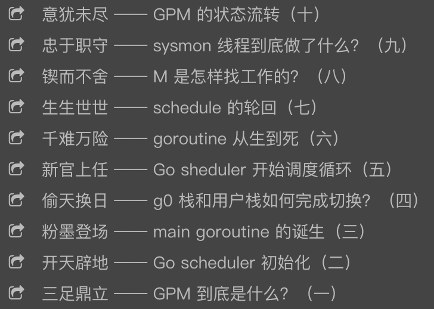
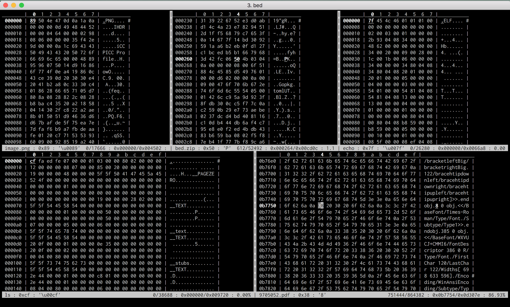

# Go语言爱好者周刊：第 7 期

这里记录每周值得分享的 Go 语言相关内容，周日发布。

本周刊开源（GitHub：[polaris1119/golangweekly](https://github.com/polaris1119/golangweekly)），欢迎投稿，推荐或自荐文章/软件/资源等，请[提交 issue](https://github.com/polaris1119/golangweekly/issues) 。

鉴于大部分人可能没法坚持把英文文章看完，因此，周刊中会尽可能推荐优质的中文文章。优秀的英文文章，我们的 GCTT 组织会进行翻译。


（题图：来源 Twitter）

## 刊首语

Go1.13 正式发布，圈内发布了相关的文章，本期周刊无疑这方面是重点。

就 Go1.13 版本对普通用户而言，有两点需要着重关注：Module 相关的改动和 errors 包新增的函数。

对于 Go1.13 的 Module，我们可以通过 GOPROXY 来控制代理，以及通过 GOPRIVATE 控制私有库不走代理。

设置 GOPROXY 代理：

> go env -w GOPROXY=https://goproxy.cn,direct

设置 GOPRIVATE 来跳过私有库，比如常用的 Gitlab 或 Gitee 或 Gitea，中间使用逗号分隔：

> go env -w GOPRIVATE=*.gitlab.com,*.gitee.com,*.gitea.com

如果在运行 go mod vendor 时，提示 `Get https://sum.golang.org/lookup/xxxxxx: dial tcp 216.58.200.49:443: i/o timeout`，则是因为 Go 1.13 设置了默认的 GOSUMDB=sum.golang.org，这个网站是被墙了的，用于验证包的有效性，可以通过如下命令关闭：

> go env -w GOSUMDB=off

## 资讯

1、[Go 1.13 正式发布，看看都有哪些值得关注的特性](https://mp.weixin.qq.com/s/7Q2vvFF88NXI3CgEFYY4mg)

核心点主要有：Module 完善、数字字面量、错误包装、默认启用 TLS1.3、逃逸分析优化、defer 性能提升、sync.Pool 优化等。[该 PPT 是另外一种获取新特性的渠道](https://docs.google.com/presentation/d/1RiZmupILuIQQ1Y-psDb1SzXNjCWh-I_-wagthdcwlq8/edit#slide=id.g604d13147b_0_113)(英文)。

2、[Grafana 6.3.5 发布，系统指标监控与分析平台](https://www.oschina.net/news/109546/grafana-6-3-5-released)

Grafana 是一个功能丰富的指标标准仪表板和图形编辑器，用于分析和监控 Graphite、Elasticsearch、OpenTSDB、Prometheus 和 InfluxDB。


3、[NSQ 1.2.0 发布，实时分布式消息传递平台](https://www.oschina.net/news/109523/tnsq-1-2-0-released)

NSQ 是无中心设计、节点自动注册和发现的开源消息系统。可作为内部通讯框架的基础，易于配置和发布。

4、[分布式图数据库 Dgraph 发布 1.1 版本](https://github.com/dgraph-io/dgraph/releases/tag/v1.1.0)

Dgraph 是一个水平可扩展的分布式图形数据库，提供 ACID 事务，一致的复制和线性化读取。它是从头开始构建的，用于执行丰富的查询。作为本机图形数据库，它严格控制数据在磁盘上的排列方式，以优化查询性能和吞吐量，减少群集中的磁盘搜索和网络调用。

5、[CoreDNS 1.6.3 发布，Go 语言实现的 DNS 服务器](https://github.com/coredns/coredns/releases/tag/v1.6.3)

CoreDNS 是一个 DNS 服务器/转发器，用 Go 编写，链式插件。 每个插件都执行（DNS）功能。

6、[protobuf 1.3 发布，从golang/protobuf fork 的版本](https://github.com/gogo/protobuf)

比 golang/protobuf 增加更多代码生成特性：

- 快速 marshalling 和 unmarshalling
- 更规范的 Go 结构
- goprotobuf 兼容性
- 通过可选地生成额外的帮助代码来减少输入
- 通过选择性地生成测试和基准代码增强信心
- 其他序列化格式

7、[REST Layer 0.2 发布，一个 REST 风格 API 框架](https://github.com/rs/rest-layer)

REST Layer 是一个受到优秀 Python Eve 启发的 API 框架。它可以帮助您在可插拔的后端存储上创建一个全面的，可自定义的，安全的 REST（graph）API，没有样板代码，因此您可以专注于您的业务逻辑。

## 问答

1、[golang map类型变量保存的是实际值所在的地址还是什么](https://segmentfault.com/q/1010000020045637)

初始化了一个map型的变量m，使用printf(%p)的格式分别对m和&m进行输出，分别得到两个地址。&m显而易见是m变量的地址，令我困惑的是m也可以输出一个地址，但有人说m保存的并非指针，那为什么m却可以输出地址？map类型的变量访问的机制是什么样的？

2、[Golang中，runtime.Caller(skip)，为什么会保留编译器变量？](https://segmentfault.com/q/1010000020145507)

在其他目录下执行非当前目录下的go文件，要求输出go文件的所在绝对路径，我才用的方法是runtime.Caller(0)，获取文件位置，但是发现，如果我在A目录下编译的go文件，mv到B目录下之后，go文件依旧输出A的目录。要实现这个需求要怎么做？

3、[疑惑 return 后面的 defer 到底会不会执行？](https://studygolang.com/topics/9967)

新手莫非有此疑惑？

4、[Go 语言中, 空的死循环与永远阻塞的 chan 细节上有什么差异?](https://www.zhihu.com/question/39766078/answer/748425459)

```go
func main() { for {} }
```

与

```go
func main() { <-make(chan struct{}) }
```

来阻止 main 函数退出。

5、[如何阅读 Golang 的源码？](https://www.zhihu.com/question/327615791/answer/756625130)

学习go语言的过程中，觉得源码写的很棒，但是有点晦涩，该怎么阅读？

6、[golang interface 作用疑惑](https://segmentfault.com/q/1010000020302054)

关于接口有些疑惑。好像用方法可以实现的逻辑，为啥非要用接口呢？ 接口反而麻烦，多写几行代码了。

7、[Go 语言 fmt.Scanf 方法的问题](https://segmentfault.com/q/1010000020296537)

```go
func main() {
    var a, b, c int
    for i := 0; i < 2; i++ {
        fmt.Scanf("%d,%d,%d", &a, &b, &c)
        fmt.Println(a, b, c)
    }
}
```

这段代码，我只输入一次，为什么会有两次输出结果？
输入：1，2，3
输出结果为：
1 2 3
1 2 3

8、[golang 框架 Gin 中间件的 c.Next() 有什么作用？](https://segmentfault.com/q/1010000020256918)

感觉用不用效果一样的啊，看文档说是执行挂起程序，具体怎么好理解一些呢，每个中间件一定要用吗？

## 文章

1、[Go语言(golang)新发布的1.13中的 Error Wrapping 深度分析](https://www.flysnow.org/2019/09/06/go1.13-error-wrapping.html)

Go 1.13发布的功能有一个值得深入研究的，就是对 Error 的增强，也是今天我们要分析的 Error Wrapping。

2、[Go1.13 defer 的性能是如何提高的？](https://mp.weixin.qq.com/s/lwBLVjdZCkwTEZzXhpwKJg)

最近 Go1.13 终于发布了，其中一个值得关注的特性就是 **defer 在大部分的场景下性能提升了30%**，但是官方并没有具体写是怎么提升的，这让大家非常的疑惑。而我因为之前写过[《深入理解 Go defer》](https://studygolang.com/articles/21224) 和 [《Go defer 会有性能损耗，尽量不要用？》](https://studygolang.com/articles/21233) 这类文章，因此我挺感兴趣它是做了什么改变才能得到这样子的结果，所以今天和大家一起探索其中奥妙。

3、[goproxy.cn - 为中国 Go 语言开发者量身打造的模块代理](https://studygolang.com/topics/10014)

[goproxy.cn](https://goproxy.cn/) 还是是一个非营利性项目，目标是为中国和世界上其他地方的 Gopher 们提供一个免费的、可靠的、持续在线的且经过 CDN 加速的模块代理。另附一篇简短的设置 Go proxy 的文章：[Go 1.13设置代理](https://studygolang.com/articles/23326)。

4、[有 GC 的编程语言就一劳永逸了吗？GODEBUG来助力 Gopher 调试 GC](https://mp.weixin.qq.com/s/V4Lwlc0KWfGfWZPYL26hZA)

通过本文我们可以掌握使用 GODEBUG 查看应用程序 GC 运行情况的方法，只要用这种方法我们就可以观测不同情况下 GC 的情况了，甚至可以做出非常直观的对比图，大家不妨尝试一下。

5、[GCTT出品 | Go 中的 gRPC 简介](https://mp.weixin.qq.com/s/KRzfUqP_4kd7Uo-xAw29NA)

给使用 Go 语言的初学者的 gRPC 概述

6、[GCTT 出品 | Go 中的缓存现状](https://mp.weixin.qq.com/s/yTUj5iTJ_yH8YeQD1qoVUQ)

这篇文章登上了 Golang 在 Reddit subreddit 板块的顶部，并在 Hacker News 首页排名到第二名。欢迎各位来阅读讨论，并在 Github 上面给我们一个小星星。

7、[Go 语言回顾：从Go 1.0到Go 1.13](https://tonybai.com/2019/09/07/go-retrospective/)

[Go 1.13版本](https://tip.golang.org/doc/go1.13)在2019.9.3[正式发布](https://blog.golang.org/go1.13)！国外的Gopher Vincent Blanchon发表了一篇文章[《Go: Retrospective》](https://medium.com/a-journey-with-go/go-retrospective-b9723352e9b0)(科学上网阅读)，对Go从1.0版本到1.13版本做了简要的回顾，这里是那篇文章的译文。


8、[深度解密Go语言之scheduler](https://qcrao.com/2019/09/02/dive-into-go-scheduler/)

来自码农桃花源的作者：饶全成 深度揭秘系列。探索 Go 语言中的调度器。



9、[一道经常考的面试题](https://studygolang.com/articles/23333)

关于循环创建 goroutine 输出的问题。

10、[Go 笔记之如何测试你的 Go 代码](https://juejin.im/post/5d6d462ef265da03e5234f57)

不论是开源项目，还是日常程序的开发，测试都是必不可少的一个环节。今天我们开始进入 Go 测试模块 testing 的介绍。

## 开源项目

1、[bild：纯 Go 实现的并行图像处理算法集合](https://github.com/anthonynsimon/bild)

一个图像处理的命令行工具，Go 语言编写。可以通过命令行参数，调节亮度、饱和度、模糊、锐化等。活脱脱一个命令行的傻瓜 PS 工具。

```bash
bild

A collection of parallel image processing algorithms in pure Go

Usage:
  bild [command]

Available Commands:
  adjust      adjust basic image features like brightness or contrast
  blend       blend two images together
  blur        blur an image using the specified method
  channel     channel operations on images
  effect      apply effects on images
  help        Help about any command
  histogram   histogram operations on images
  imgio       i/o operations on images
  noise       noise generators
  segment     segment an image using the specified method

Flags:
  -h, --help      help for bild
      --version   version for bild

Use "bild [command] --help" for more information about a command.
```

2、[lefthook：快速而强大的 Git 钩子管理器，适用于任何类型的项目](https://github.com/Arkweid/lefthook)

Git 钩子管理器，可以用在各种项目之中。特点是功能强大，允许并行执行多个任务。

3、[cache2go：具有过期功能和访问计数器的并发安全 Go 缓存库](https://github.com/muesli/cache2go)

可以当作本地缓存库使用。

4、[Litter：一个用于调试的辅助工具，可以漂亮的打印出 Go 数据结构](https://github.com/sanity-io/litter)

比如下面的代码：

```go
type Person struct {
	Name   string
	Age    int
	Parent *Person
}

litter.Dump(Person{
	Name:   "Bob",
	Age:    20,
	Parent: &Person{
		Name: "Jane",
		Age:  50,
	},
})
```

输出是：

```
Person{
	Name: "Bob",
	Age: 20,
	Parent: &Person{
		Name: "Jane",
		Age: 50,
	},
}
```

是不是比通常的输出好看多了呢？

5、[xxhash：64位 XxHash 算法的实现，XXH64](https://github.com/cespare/xxhash)

一种高质量的哈希算法，比 Go 标准库中的任何算法都要快得多。

6、[dbx：一个支持 KV 缓存全表数据的高性能 golang db 库](https://github.com/mydeeplike/dbx)

一个支持对全表数据进行透明缓存的 Golang DB 库，在内存足够大的情况下，不再需要 Memcached, Redis 等缓存服务。 而且读取缓存的速度相当之快，本机测试 qps 达到: 350万+/秒，可以有效的简化应用端业务逻辑代码。 它支持 MySQL/Sqlite3，支持结构体自由组合嵌套。 它的实现原理为自动扫描表结构，确定主键和自增列，并且通过主键按照行来缓存数据，按照行透明管理 cache，上层只需要按照普通的 ORM 风格 API 操作即可。

7、[joe：一个通用的机器人库，受 Hubot 的启发，但是用 Go 编写](https://github.com/go-joe/joe)

Joe是一个用于在 Go 编程语言中编写聊天机器人的库。它 Hubot 框架的启发，并为想要使用 Go 实现聊天机器人的人们带来了它的便利。

8、[elton：高性能、简单的、类 koa 的Web 框架](https://github.com/vicanso/elton)

开始接触后端开发是从 nodejs 开始，最开始使用的框架是 express，后来陆续接触了其它的框架，觉得最熟悉的还是koa。使用 golang 做后端开发时，对比使用过 gin，echo 以及 iris 三个框架，它们的用法都类似（都支持中间件，中间件的处理也类似），但是在开发过程中还是钟情于 koa 的处理方式，失败则 throw error，成功则将响应数据赋值至 ctx.body，简单易懂。于是造了这个轮子。

9、[bokchoy：基于 Redis 的 Go 简单队列](https://github.com/thoas/bokchoy)

Bokchoy是一个简单的 Go 库，用于排队任务并在后台与工作人员一起处理它们。它应该很容易集成到您的 Web 堆栈中，并且它的设计目标是为新手提供较低的屏障。

## 资源&&工具

1、[TeaWeb：可视化的 Web 代理服务](https://github.com/TeaWeb/build)

集静态资源、缓存、代理、统计、日志、安全、监控于一体的可视化智能 WebServer。使用Go语言实现，在高可定制化前提下，保证高性能、高并发。

2、[curlie：用于 HTTP 请求的 CLI 工具](https://github.com/rs/curlie)

如果您喜欢 HTTPie 的界面但却错过了 curl 的功能，那么 curlie 就是您想要的工具。 Curlie 是 curl 的前端，增加了httpie的易用性，而不会影响功能和性能。


3、[bed：用 Go 编写的二进制/十六进制编辑器](https://github.com/itchyny/bed)



4、[阿里云大学开发者课堂](https://edu.aliyun.com/developer)

数据时代的IT技能学习平台，云计算、大数据、人工智能等前沿及基础技术课程学、练、测、在线实验一站式体验。包含各种视频教程。大部分都是免费的。

5、[帮助你下次技术面试的资料汇总](https://github.com/yangshun/tech-interview-handbook)

精心策划的内容可帮助您完成下一次技术面试，重点关注算法。

6、[轻进存销管理系统](https://github.com/Allenxuxu/mogutouERP)

mogutouERP 是一个前后端分离的微型进存销系统，采用 Gin + Vue 开发。如果你觉得没有项目练手，可以看看别人怎么开发一个项目的。

7、[Gin Weibo App](https://github.com/Away0x/gin_weibo)

练习项目，使用 Gin 框架实现简单的微博功能。

8、[YourNovel-基于Golang的开源小说搜索引擎&免费小说阅读网站](https://github.com/DemonFengYuXiang/YourNovel)

这里小说不是我要推荐的关键，还是这个项目本身，学习使用 Go 语言搭建一个网站，爬取相关的数据的技术。

## 订阅

这个周刊每周日发布，同步更新在[Go语言中文网](https://studygolang.com/go/weekly)、[微信公众号](https://weixin.sogou.com/weixin?query=Go%E8%AF%AD%E8%A8%80%E4%B8%AD%E6%96%87%E7%BD%91) 和 [今日头条](https://www.toutiao.com/c/user/59903081459/#mid=1586087918877709)。

微信搜索"Go语言中文网"或者扫描二维码，即可订阅。


