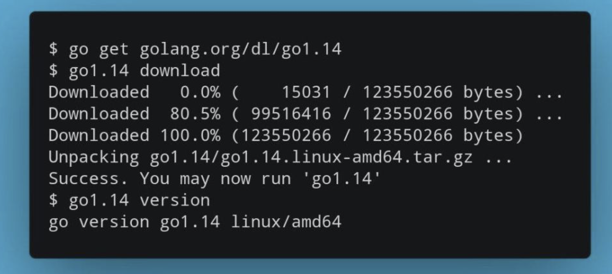
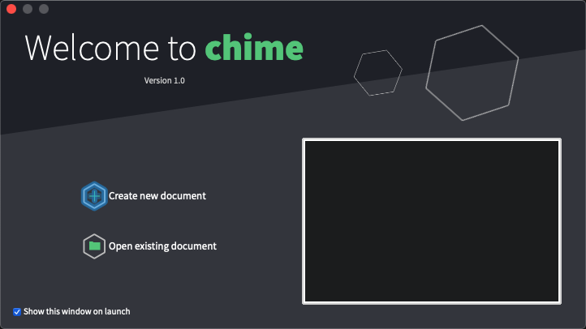
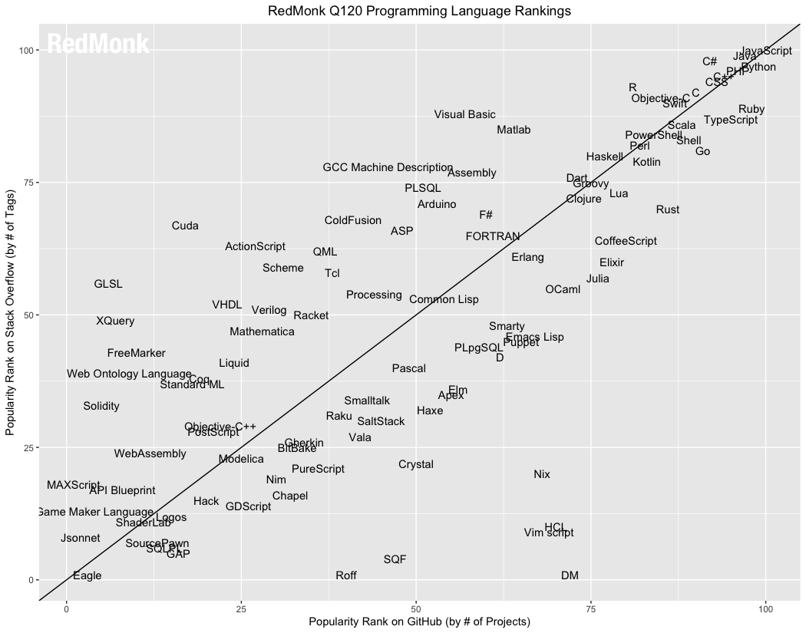

# Go语言爱好者周刊：第 32 期

这里记录每周值得分享的 Go 语言相关内容，周日发布。

本周刊开源（GitHub：[polaris1119/golangweekly](https://github.com/polaris1119/golangweekly)），欢迎投稿，推荐或自荐文章/软件/资源等，请[提交 issue](https://github.com/polaris1119/golangweekly/issues) 。

鉴于大部分人可能没法坚持把英文文章看完，因此，周刊中会尽可能推荐优质的中文文章。优秀的英文文章，我们的 GCTT 组织会进行翻译。

题图：Go1.14 发布

## 资讯

1、[Go1.14 发布](https://mp.weixin.qq.com/s/SUiud3nThZcSHJEJ_BTO3g)

- Go Module 已经可用于生产环境
- 允许接口方法进行重叠
- 几乎零成本的 defer 语句
- 调度器支持非协作异步抢占
- 全新的页分配器实现
- 全新的计时器实现

[关于Go1.14，你一定想知道的性能提升与新特性](https://mp.weixin.qq.com/s/ESf4-h1S9WeQNH2Z-kVIKw)。中文翻译版[发版说明](https://mp.weixin.qq.com/s/KmPdvsQ_3zAVZd2bf45kPQ)。

2、[全新的、专为 Go 打造的编辑器 Chime：使用体验报告](https://mp.weixin.qq.com/s/kngi5Ze3eUUA6HzNg70f_w)

专门为 Go 语言编写的编辑器，只能 Mac 下使用，体验结果差评！

3、[RedMonk 编程语言排行榜：Go 名列 15 位](https://redmonk.com/sogrady/2020/02/28/language-rankings-1-20/)

这个排名怎么看？

4、[giu v0.3 发布](https://github.com/AllenDang/giu)

基于 Dear ImGui 的 用于 golang 的跨平台快速 GUI 框架。

## 文章

1、[如何正确看待 Google 宣布 Fuchsia 操作系统没有选 Go 作为终端开发语言](https://mp.weixin.qq.com/s/E1UeZHgHKmd28ww938muig)

谷歌新一代开源操作系统 Fuchsia 的开发者网站上公布了一份 Fuchsia 编辑语言策略，文档描述了 C、C++、Dart、Rust 与 Go 的优劣势，并明确指定了其中哪些语言将会在 Fuchsia 开发生态中得到怎样程度的支持。

2、[Actor 还是 CSP？Go 中的并发模式还能讲这么细致](https://mp.weixin.qq.com/s/yehR1e0HO400aiUzI4KwZw)

并发：强调一段时间做多件事；并行：强调同一时间做多件事。

3、[Gopher 学习效率低怎么办？曹大谈工程师应该怎么学习](https://mp.weixin.qq.com/s/EyD5uFbYtSIc0iHtNW2bww)

只要一日自诩工程师，就没有办法放弃学习。本文不算是技术文，只是介绍一些个人的学习方法和经验。如果很多点你已经做到并且做好，一笑了之便可。

4、[Go语言之禅](https://tonybai.com/2020/02/24/the-zen-of-go/)

本文来自我在[GopherCon Israel 2020](https://www.gophercon.org.il/)上的演讲。文章很长:) 如果您希望阅读精简版，请移步到[the-zen-of-go.netlify.com](https://the-zen-of-go.netlify.com/)。

5、[Go 高级并发](https://studygolang.com/articles/26864)

在扩展库 [golang.org/x/sync](https://pkg.go.dev/golang.org/x/sync) 中，提供了一系列更高级别的并发原语。我们将在本文中来谈谈这些内容。

6、[Go 每日一库之 gojsonq](https://juejin.im/post/5e53e2efe51d4527196d5352)

在日常工作中，每一名开发者，不管是前端还是后端，都经常使用 JSON。JSON 是一个很简单的数据交换格式。相比于 XML，它灵活、轻巧、使用方便。JSON 也是[RESTful API](http://www.ruanyifeng.com/blog/2014/05/restful_api.html)推荐的格式。有时，我们只想读取 JSON 中的某一些字段。如果自己手动解析、一层一层读取，这就变得异常繁琐了。特别是在嵌套层次很深的情况下。今天我们介绍[`gojsonq`](https://github.com/thedevsaddam/gojsonq)。它可以帮助我们很方便的操作 JSON。

7、[Go Modules 终极入门](https://mp.weixin.qq.com/s/fNMXfpBhBC3UWTbYCnwIMg)

Go modules 是 Go 语言中正式官宣的项目依赖解决方案，Go modules（前身为vgo）于 Go1.11 正式发布，在 Go1.14 已经准备好，并且可以用在生产上（ready for production）了，Go 官方也鼓励所有用户从其他依赖项管理工具迁移到 Go modules。

8、[Golang连接池的几种实现案例](https://juejin.im/post/5e58e3b7f265da57537eb7ed)

因为TCP的三只握手等等原因，建立一个连接是一件成本比较高的行为。所以在一个需要多次与特定实体交互的程序中，就需要维持一个连接池，里面有可以复用的连接可供重复使用。

9、[Go 为什么这么“快”](https://mp.weixin.qq.com/s/ihJFa5Wir4ohhZUXVSBvMQ)

本文主要介绍了 Go 程序为了实现极高的并发性能，其内部调度器的实现架构（G-P-M 模型），以及为了最大限度利用计算资源，Go 调度器是如何处理线程阻塞的场景。

10、[Golang channel 源码深度剖析](https://www.cyhone.com/articles/analysis-of-golang-channel/)

channel 在 Golang 如此重要，在代码中使用频率非常高，以至于不得不好奇其内部实现。本文将基于 [go 1.13 的源码](https://github.com/golang/go/tree/dev.boringcrypto.go1.13)，分析 channel 的内部实现原理。

11、[Go Sync.Pool作用及遇到的坑](https://studygolang.com/articles/26841)

Go中有sync.Pool类型，我们可以把它理解成存放临时值的容器，之所以加上“临时”两个字，是因为它会在GC过程的STW步骤被清理。

12、[Go 语言网络轮询器的实现原理](https://mp.weixin.qq.com/s/wwyxfWrvNMRhB1fLrZQRww)

在今天，大部分的服务都是 I/O 密集型的，应用程序会花费大量时间等待 I/O 操作执行完成。网络轮询器就是 Go 语言运行时用来处理 I/O 操作的关键组件，它使用了操作系统提供的 I/O 多路复用机制增强程序的并发处理能力。本节会深入分析 Go 语言网络轮询器的设计与实现原理。

## 开源项目

1、[esquery](https://github.com/aquasecurity/esquery)

非官方，但符合 Go 习惯的 ElasticSearch 查询构造器。可以让你编写更简单，流畅的代码来表示查询。目前是在开发中，不建议生产环境使用。

2、[gnark: 快速的零知识证明库](https://github.com/consensys/gnark)

gnark 是一个速度快、开源的库，用于以 Go 语言编写的零知识证明协议。

3、[shox: 可定制的，通用兼容的终端状态栏](https://github.com/liamg/shox)

实验性的，但是以一种有趣的方式工作（它代理你的 shell 输出并调整 ANSI 绘图命令，以便它可以保持在顶部）。

4、[httpmole](https://github.com/jcchavezs/httpmole)

HTTP mock 服务。

5、[parallel](https://github.com/ryanskidmore/parallel)

Go 语言并行处理库。

6、[gouku](https://github.com/alash3al/goukv)

类似 database/sql 的抽象层，但用于 Key-Value 存储。这里有一篇介绍文章：<https://mp.weixin.qq.com/s/nkQyiVYFe1jQL1G0DkI1RA>。

7、[gron: 让你的 json 可以 grep](https://github.com/tomnomnom/gron)

gron 将 JSON 转换为离散的值，以使其更易于根据需要进行grep并查看其绝对“路径”。它简化了对返回大块 JSON 但具有糟糕文档的 API 的探索。介绍文章：<https://mp.weixin.qq.com/s/0n7cXicUs14TjFyUlhDcxA>。

8、[gosubmit](https://github.com/jeremija/gosubmit)

解析和提交 HTML 表单。

9、[gogw](https://github.com/xitongsys/gogw)

基于 HTTP1.1 的快速端口转发或反向转发工具。

## 资源&&工具

1、[视频：Go 函数的乐趣](https://www.youtube.com/watch?v=dtOQ86tLr4I)

youtube 的视频。

2、[Go 书目列表](https://github.com/dariubs/GoBooks/)

整理的书还是挺多的。

3、[整洁架构（Clean Architecture）的Go微服务: 程序结构](https://mp.weixin.qq.com/s/hwHWMiU-nMrmdc_BpBl4vQ)

我使用 Go 和 gRPC 创建了一个微服务，并试图找出最佳的程序结构，它可以用作我未来程序的模板。我写了一系列关于在项目工作中做出的设计决策和取舍的文章。这是其中的第一篇， 是关于程序结构的。公众号发布了这个系列。

4、[视频：使用 Gorm 和 MySQL 构建 RESTful API](https://www.youtube.com/watch?v=YtWBxxZg1WI&t=458s)

youtube 的视频。

## 订阅

这个周刊每周日发布，同步更新在[Go语言中文网](https://studygolang.com/go/weekly)和[微信公众号](https://weixin.sogou.com/weixin?query=Go%E8%AF%AD%E8%A8%80%E4%B8%AD%E6%96%87%E7%BD%91)。

微信搜索"Go语言中文网"或者扫描二维码，即可订阅。

